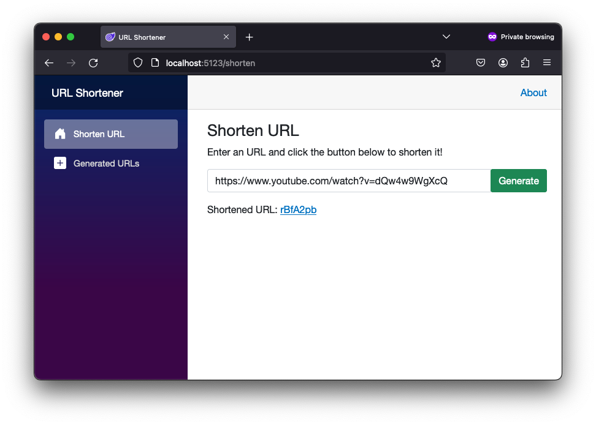
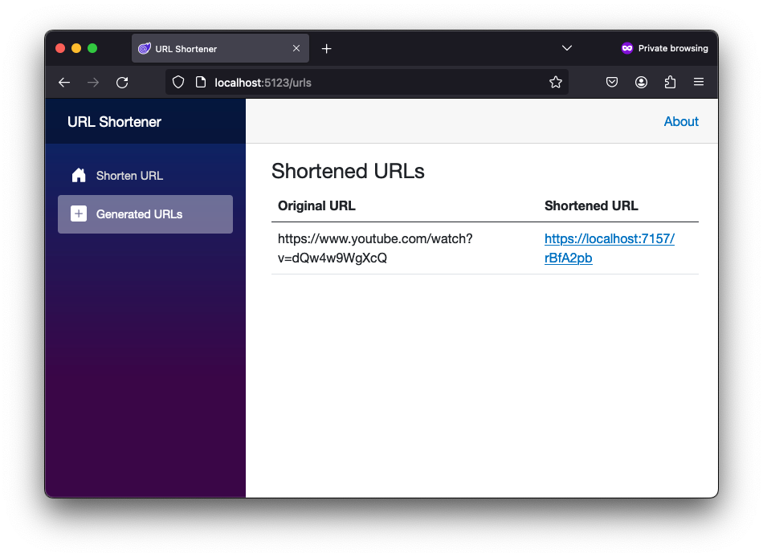

# URL Shortener in .NET 8

## Overview

This example demonstrates how to create an URL shortener in ASP.NET Core 8 using MinimalAPI, Entity Framework Core and a Postgres Database with Docker.
This repository is based on [this blog post](https://www.milanjovanovic.tech/blog/how-to-build-a-url-shortener-with-dotnet) but makes use of a Postgres database running in Docker.

This solution also contains a Blazor WebAssembly Client application.





## Prerequisites
- .NET 8 SDK
- Docker

## Getting Started

1. Application settings:

Setup your desired database name and password in `app-settings.json`. Copy `app-settings.example.json` and rename it to `app-settings.json` if you want to use the default settings.

2. Configure PostgreSQL Docker Container:

Install Docker and make sure the Docker daemon is running on your machine.
Run the following command to pull and run a PostgreSQL Docker container:

```bash
docker pull postgres
docker run --name your-database-name -e POSTGRES_PASSWORD=your-password -p 5432:5432 -d postgres
``` 

3. Apply the latest migration
```bash
dotnet ef database update
```

4. Run the application
```bash
dotnet run
```